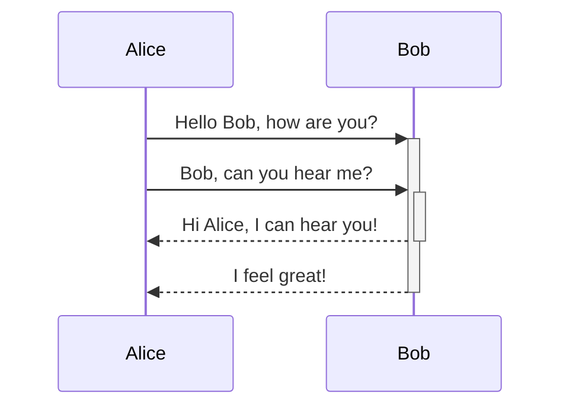

This is xyz's first blog.

<!-- more -->

Welcome to Hexo!

Test for mermaid graph:

Test for mathematical expressions below:

## 6.

### Question

设 $C_1$ 和 $C_2$ 为服从正态分布的两个训练集合，$x$ 为一个待测样本，则根据贝叶斯公式有 $P(C_1|x) = \frac{P(x \mid C_1)P(C_1)}{P(x \mid C_1)P(C_1) + P(x \mid C_2)P(C_2)}$ ，

若设 $z = \mathrm{ln}\frac{p(x \mid C_1)P(C_1)}{p(x \mid C_2)P(C_2)}$ ，

证明：$z$ 是一个线性超平面，并且 $P(C_1|x) = \mathop{\sigma(z)}\limits_{\begin{aligned}\substack{\text{Sigmoid}}\\ \substack{\text{function}} \end{aligned}}$

### Answer

**证明：**

由贝叶斯公式，

$$
P(C_1|x) = \frac{P(x \mid C_1)P(C_1)}{P(x \mid C_1)P(C_1) + P(x \mid C_2)P(C_2)} \\
P(C_1|x) = \frac{1}{1 + \frac{P(x \mid C_2)P(C_2)}{P(x \mid C_1)P(C_1)}}
$$

而 $z = \mathrm{ln}\frac{p(x \mid C_1)P(C_1)}{p(x \mid C_2)P(C_2)}$，代入以上得 

$$
P(C_1|x) = \frac{1}{1 + e^{-z}} = \mathop{\sigma(z)}\limits_{\begin{aligned} \substack{\text{Sigmoid}}\\ \substack{\text{function}} \end{aligned}}
$$

即证得 $P(C_1|x) = \mathop{\sigma(z)}\limits_{\begin{aligned} \substack{\text{Sigmoid}}\\ \substack{\text{function}} \end{aligned}}$

下面证明 $z$ 是一个线性超平面。

对 $z$ 变换得：

$$
z = \mathrm{ln}\frac{P(x \mid C_1)}{P(x \mid C_2)} + \mathrm{ln}\frac{P(C_1)}{P(C_2)} \tag{1}
$$

设 $C_1$ 在训练集中出现次数为 $N_1$，$C_2$ 在训练集中出现次数为 $N_2$，则

$$
\mathrm{ln}\frac{P(C_1)}{P(C_2)} = \mathrm{ln}\frac{\frac{N_1}{N_1 + N_2}}{\frac{N_2}{N_1 + N_2}} = \mathrm{ln}\frac{N_1}{N_2}
$$

其中 $P(x \mid C_1)$，$P(x \mid C_2)$ 遵从正态分布，即

$$
P(x \mid C_1) = \frac{1}{2\pi^{\frac{D}{2}}}\frac{1}{|\Sigma_1|^{\frac{1}{2}}}e^{-\frac{1}{2}(x - \mu_1)^\top \Sigma_1^{-1}(x - \mu_1)} \\ \  \\
P(x \mid C_2) = \frac{1}{2\pi^{\frac{D}{2}}}\frac{1}{|\Sigma_2|^{\frac{1}{2}}}e^{-\frac{1}{2}(x - \mu_2)^\top \Sigma_2^{-1}(x - \mu_2)}
$$

代入 $(1)$ 式中第一项，

$$
\begin{aligned}
&\mathrm{ln}\frac{P(x \mid C_1)}{P(x \mid C_2)}\\ \ \\
&=
\mathrm{ln}
\frac{
\frac{1}{2\pi^{\frac{D}{2}}}
\frac{1}{|\Sigma_1|^{\frac{1}{2}}}
e^{-\frac{1}{2}(x - \mu_1)^\top \Sigma_1^{-1}(x - \mu_1)}
}
{
\frac{1}{2\pi^{\frac{D}{2}}}
\frac{1}{|\Sigma_2|^{\frac{1}{2}}}
e^{-\frac{1}{2}(x - \mu_2)^\top \Sigma_2^{-1}(x - \mu_2)}
} \\ \ \\
&= \mathrm{ln}\frac{ \frac{1}{|\Sigma_1|^{\frac{1}{2}}}e^{-\frac{1}{2}(x - \mu_1)^\top \Sigma_1^{-1}(x - \mu_1)}}{\frac{1}{|\Sigma_2|^{\frac{1}{2}}}e^{-\frac{1}{2}(x - \mu_2)^\top \Sigma_2^{-1}(x - \mu_2)}} \\ \ \\
&= \mathrm{ln}\frac{ \frac{1}{|\Sigma_1|^{\frac{1}{2}}}}{\frac{1}{|\Sigma_2|^{\frac{1}{2}}}}e^{-\frac{1}{2}[(x - \mu_1)^\top \Sigma_1^{-1}(x - \mu_1) - (x - \mu_2)^\top \Sigma_2^{-1}(x - \mu_2)]} \\ \ \\
&= \mathrm{ln}\frac{ \frac{1}{|\Sigma_1|^{\frac{1}{2}}}}{\frac{1}{|\Sigma_2|^{\frac{1}{2}}}} - \frac{1}{2}[(x - \mu_1)^\top \Sigma_1^{-1}(x - \mu_1) - (x - \mu_2)^\top \Sigma_2^{-1}(x - \mu_2)]
\end{aligned}
$$

对 $(x - \mu_1)^\top \Sigma_1^{-1}(x - \mu_1)$ 化简：

$$
(x - \mu_1)^\top \Sigma_1^{-1}(x - \mu_1) = x^\top \Sigma_1^{-1}x - 2\mu_1\Sigma_1^{-1}x + \mu_1^\top \Sigma_1^{-1}\mu_1
$$

同理得

$$
(x - \mu_2)^\top \Sigma_2^{-1}(x - \mu_2) = x^\top \Sigma_2^{-1}x - 2\mu_2\Sigma_2^{-1}x + \mu_2^\top \Sigma_2^{-1}\mu_2
$$

代入 $z$，得

$$
z = \mathrm{ln}\frac{|\Sigma_2|^{\frac{1}{2}}}{|\Sigma_1|^{\frac{1}{2}}{}} - \frac{1}{2}[x^\top \Sigma_1^{-1}\mu_1 - 2\mu_1\Sigma_1^{-1}x + \mu_1^\top \Sigma_1^{-1}\mu_1 - x^\top \Sigma_2^{-1}x + 2\mu_2\Sigma_2^{-1}x - \mu_2^\top \Sigma_2^{-1}\mu_2] + \mathrm{ln}\frac{N_1}{N_2}
$$

由于如果每个类的协方差 $\Sigma$ 不同，会使方差过大，参数过多。则可认为 $\Sigma_1 = \Sigma_2 = \Sigma$.

于是化简 $z$ 为：

$$
z = (\mu_1 - \mu_2)\Sigma^{-1}x - \frac{1}{2}\mu_1^\top \Sigma^{-1}\mu_1 + \frac{1}{2}\mu_2^\top \Sigma^{-1}\mu_2 + \mathrm{ln}\frac{N_1}{N_2}
$$

观察，令 $(\mu_1 - \mu_2)\Sigma^{-1} = \omega^\top $， $-\frac{1}{2}\mu_1^\top \Sigma^{-1}\mu_1 + \frac{1}{2}\mu_2^\top \Sigma^{-1}\mu_2 + \mathrm{ln}\frac{N_1}{N_2} = b$

则

$$
z = \omega^\top x + b
$$

所以证得：$z$ 是一个线性超平面。

综上，证得：$z$ 是一个线性超平面，并且 $P(C_1|x) = \mathop{\sigma(z)}\limits_{\begin{aligned} \substack{\text{Sigmoid}}\\ \substack{\text{function}} \end{aligned}}$

